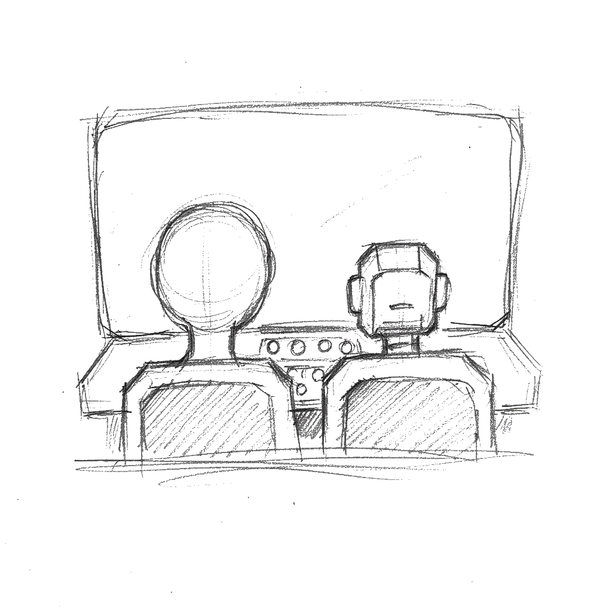
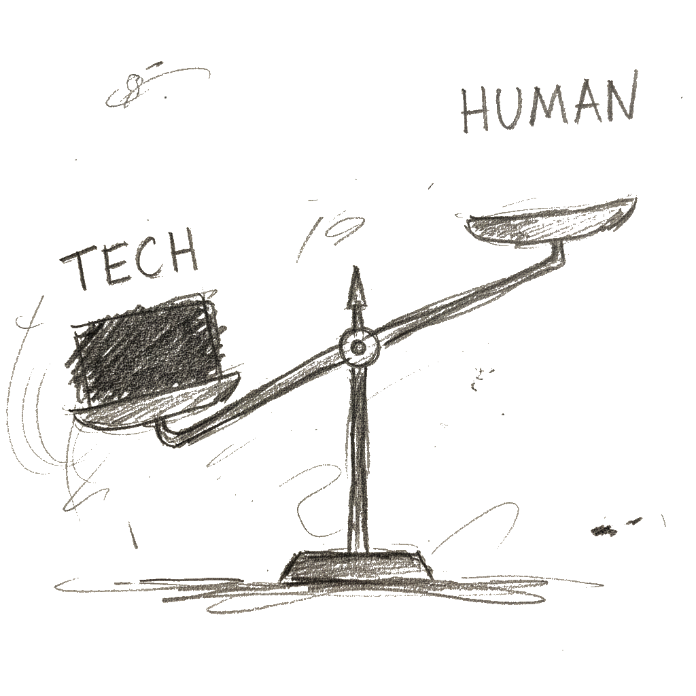
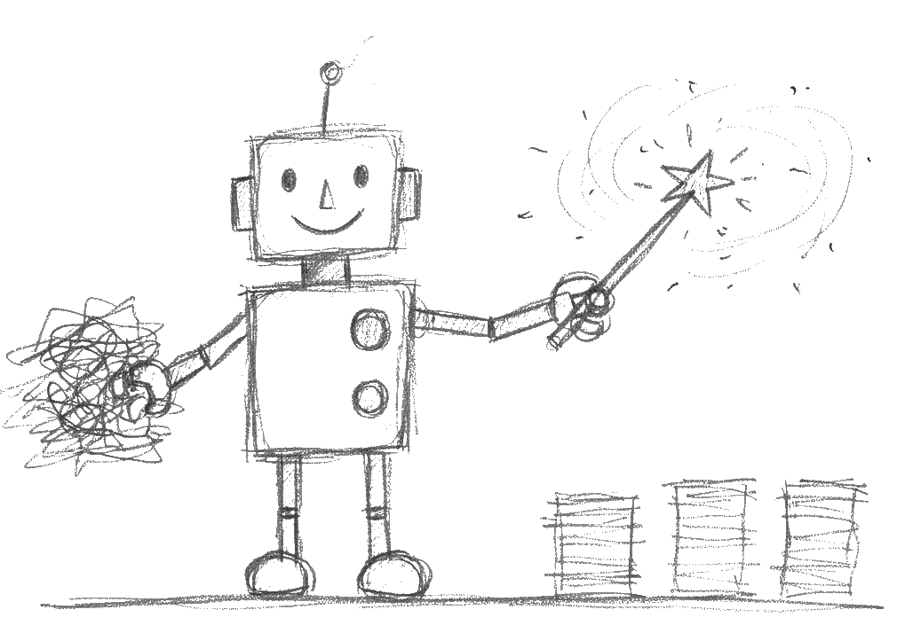
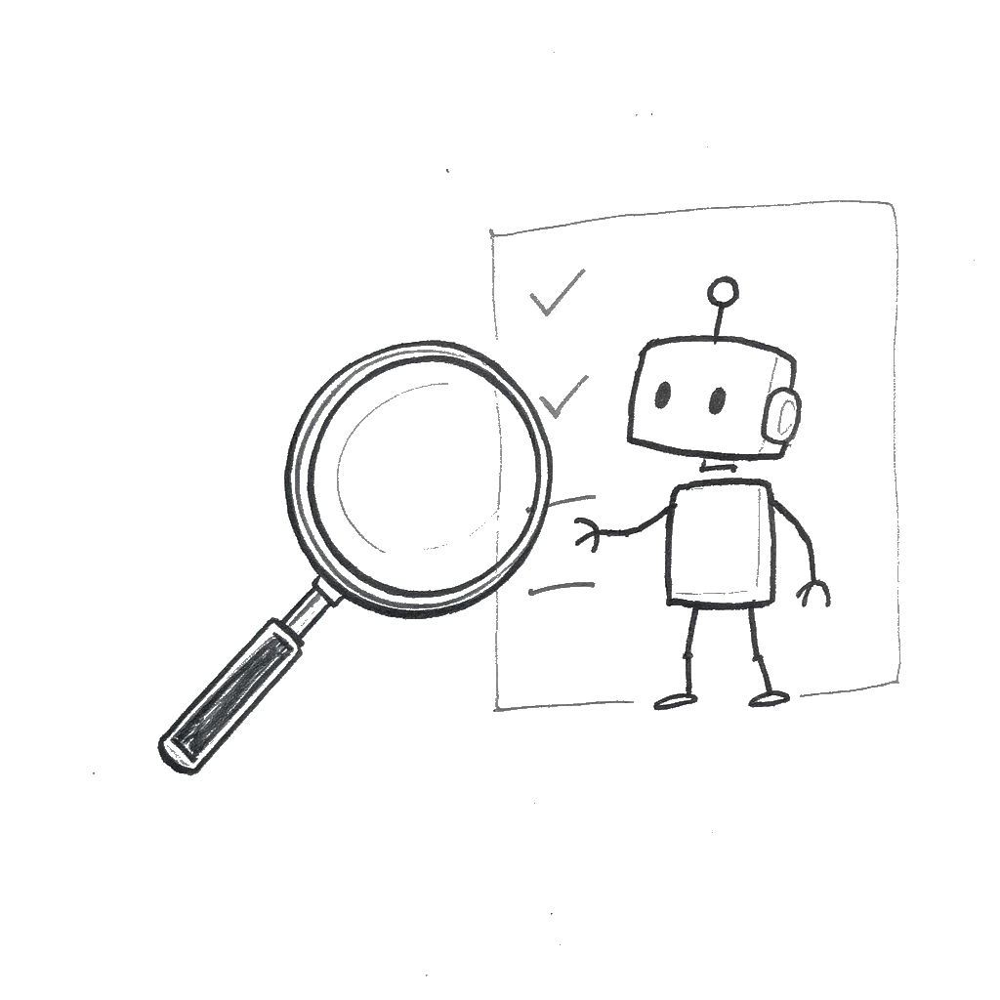

# Welcome & The AI Landscape

---

# Intelligent Tutoring Systems (ITS)

---

# The Architect (Pedagogical Design)

---

# The Practitioner (Pedagogical Delivery)

---

# Challenges & Limitations

---

# The Evolving Role of the Educator

---

# Activity 1: Automate the Tedious

---

# Activity 2: The Art of the Prompt

---

# Activity 3: Your 5-Step Critique Framework

---

# Activity 4: The "Assessment Stress-Test"

---

# Activity 5: Secure, Safe, and Sustainable AI

---

# Wrap-Up & Next Steps

