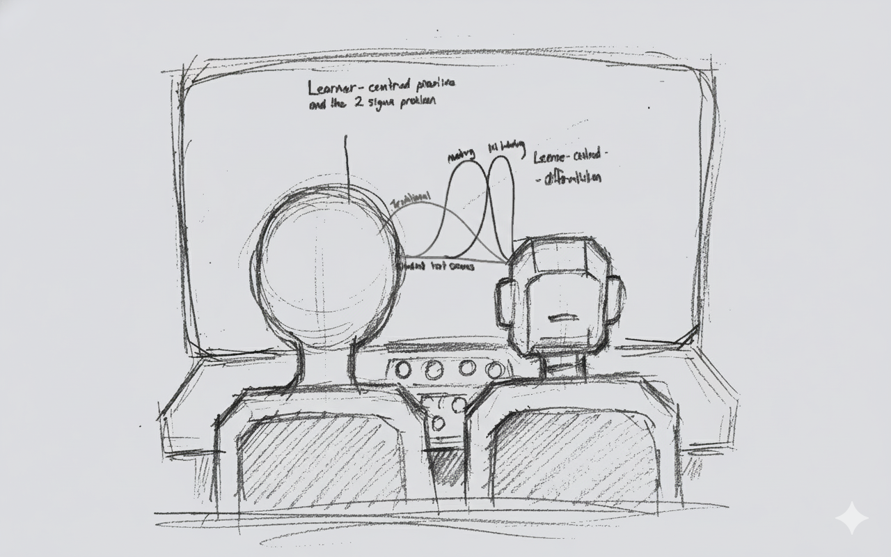

# Welcome & The AI Landscape

::: {.notes}

**Opening hook (Bloom + AI tutors):**

> “Two standard deviations.  
> [pause 2–3 seconds, make eye contact]  
> That’s the gap Benjamin Bloom reported in the 1980s between students in a typical classroom and students who received **one‑to‑one human tutoring** – enough to turn an average student into a top performer.  
>  
> Fast‑forward forty years. Sal Khan – the Khan Academy guy – stands on a TED stage and says: with AI tutors and AI teaching assistants, we might finally be able to get **something like that 2‑sigma effect at scale**. A personal tutor for every student, and an AI assistant for every teacher.  
>  
> Whether that makes you excited or slightly ill, it raises a very practical question for us here at Curtin:  
> If tools like this are going to sit in our students’ hands – and in our own enterprise Copilot environment – **how do we design teaching, assessment and support so that we get the upside without losing what actually matters?**  
> And how does that sit alongside **Assessment 2030**, academic integrity, and the reality that students can now summon a ‘tutor’ at 2am from their phone?”

To widen beyond teaching staff, you can add:

> “Even if you’re not teaching every day, there’s a similar promise in our 
> research and professional roles – a kind of **co‑pilot for the boring parts** 
> of our jobs – drafting, summarising, chasing patterns – so we can spend more 
> time on work that needs human judgement and relationships.”

**Position the session:**

> “That’s what this session is about. We’re going to:  
> – Experiment with using AI to **automate some of the tedious work**,  
> – Practise how to **design prompts** and **critique AI outputs**, and  
> – Stress‑test our own assessments and practices in the spirit of **Assessment 2030** – not to ban AI, but to redesign so that **student judgement, process, and human skills** remain irreplaceable.”

You can lightly nod to risks, but unpack them later:

> “We also know from recent work that if we lean too hard on these tools, we risk **cognitive offloading**, students feeling less connected, and making cheating easier if our assessments are too automatable. So we’ll spend as much time on **how to critique and design around AI** as we do on the shiny productivity side.”

:::

---

# What We’ll Do Today  

- Set the scene: AI, Assessment 2030, and your context  
- Try out 5 hands‑on activities:  
   - Automate some of the tedious work  
   - Design better prompts  
   - Critique AI outputs with a simple framework  
   - Use AI in a multi‑step workflow to probe or redesign a task  
   - Make one small commitment about safe AI use  
- Wrap up with key takeaways and next steps

::: {.notes}

So the shape of the next two hours is roughly this: a bit of context to connect AI to Assessment 2030, then five very practical activities – automate, prompt, critique, multi‑step workflows, and safe use – and then a short wrap‑up.  

It’s designed to be mostly hands‑on and beginner‑friendly, with space for questions and discussion as we go.

For Activity 4 we have two possible paths, depending on how much Assessment 2030 you’ve already had today:  
we can either probe one of our assessments with AI and discuss redesign, or we can use a multi‑step AI workflow to tackle one of those ‘impossible’ teaching or design problems. We’ll pick on the day based on the room.

You can also briefly note that the **presentation and companion website themselves** are examples of using AI as a co‑pilot:

> “Just as we’ll explore today, these slides and the website were developed with AI support – for drafting, structuring and idea generation – but always with human oversight, editing and verification. So this session is very much about *walking the talk* as well as talking about it.”

:::

---

# Intelligent Tutoring Systems (ITS)

::: {.notes}

**Key Takeaway:** ITS deliver **personalised, one-on-one instruction** by relying on an integrated architecture of four key components: the **Domain Model** (what is taught), the **Learner Model** (who is learning, including successes and misconceptions), the **Tutoring Model** (how to teach), and the **User Interface Model** (interaction). The quality of instruction is directly determined by the sophistication of these underlying models, which collectively ensure that the system adjusts the pace, difficulty, and focus of lessons in real-time.

**Analogy:** Intelligent Tutoring Systems function much like an automated personal trainer at a gym. Just as the trainer analyzes your current fitness level, pace, and weaknesses (the **Student Model**), knows the curriculum of exercises (the **Domain Model**), and determines the optimal routine to challenge you without overwhelming you (the **Tutoring Model**), the ITS continuously adjusts the learning path to ensure instruction is both challenging and achievable, promoting deeper understanding.

:::
---

# The Architect (Pedagogical Design)

::: {.notes}

**Key Takeaway:** AI fundamentally transforms the pedagogical designer's role from a manual content creator to a **Strategic Architect** by automating previously slow and tedious tasks, such as generating course outlines, assessments, and multimedia. This automation forces the designer to focus on **high-level, human-centric design**—creating flexible, dynamic frameworks and addressing emotional barriers to learning, rather than formatting slides or writing quiz questions.

**Analogy:** If traditional pedagogical design was like crafting a single, hand-built ship (a static course) that everyone had to sail on, the AI era redesigns the role of the architect. The new Pedagogical Architect now designs a complex, adaptive fleet where each ship (module) can adjust its sails, speed, and navigation (difficulty, pace, content) based on the real-time weather (student performance data), ensuring everyone reaches their destination, but along a personalised route. The architect’s most critical new job is ensuring the human crew (teachers and students) still communicate and build rapport, not just follow the automated navigation system.

:::

---

# The Practitioner (Pedagogical Delivery)

::: {.notes}

**Key Takeaway:** AI revolutionizes pedagogical delivery by collapsing the feedback loop and providing educators with **real-time data insights** into student progress, performance patterns, and cognitive states. This data-driven delivery allows the human teacher to transition into a **"real-time interventionist,"** enabling them to abandon content presentation to the "average" student and instead focus on targeted, high-value interventions based on immediate, actionable data.  It can be viewed the impact of AI on pedagogical delivery not as a replacement for the teacher, but as an augmented reality for the classroom. AI handles the mechanics of instruction and data analysis, allowing the human practitioner to execute their craft with surgical precision, focusing their limited time on high-value, empathetic, and complex human interactions.

**Analogy:**. AI in the classroom functions as an AI Co-Pilot. The AI (co-pilot) handles the routine mechanics of flight (content delivery, system monitoring, and performance tracking), allowing the human pilot (the educator) to focus on complex navigation, communicating with the crew (students), and managing unexpected turbulence (misconceptions or emotional barriers) with surgical precision.

:::

---

# Challenges & Limitations

::: {.notes}

**Key Takeaway:** Despite the technological promise, a critical challenge for AIED is the **risk of eroding the human element** and exacerbating **educational inequity** through algorithmic bias. Over-reliance on ITS and generative tools can reduce valuable face-to-face interactions, while studies show that students using AI sometimes feel **less connected to their teachers** (the "paradox of connection"). Furthermore, predictive models trained on historical data risk perpetuating existing biases against marginalized groups when allocating resources or flagging "at-risk" learners.

Recent work also highlights broader risks: generative AI can **hallucinate** plausible but incorrect information, enable large‑scale **misinformation and deepfakes**, and make it easier to **circumvent traditional assessments** if those tasks are easily automated. These are not reasons to ban AI outright, but reasons to **redesign tasks and guardrails** so that human judgement and process remain visible.

You can link this directly to **Assessment 2030** and later activities:

> “Assessment 2030 is essentially our institutional response to these challenges. Rather than pretending AI doesn’t exist, we redesign assessment and learning activities so that **student thinking and judgement** are what really matter. Activities 3–5 in this workshop are about giving you practical ways to do that.”

**Analogy:** Think of AIED as a new, highly efficient Automated Factory. While it produces learning materials at scale (efficiency), it risks creating a sterile, one-size-fits-all product that lacks the "human touch" (eroding connection). More dangerously, if the factory's blueprints (the algorithm) have a flaw (bias), it doesn't just create one bad product; it replicates that flaw thousands of times, perpetuating the inequity at scale.

:::

---

# The Evolving Role of the Educator

::: {.notes}

**Key Takeaway:** The long-term impact of AI is a **forced re-humanization** of the educator's role, where the practitioner is compelled to abandon the commoditized, technical tasks (which AI can perform) and focus on the **Human Edge of AI**. This means prioritizing **empathy, creativity, strategic thinking, mentorship, and socio-emotional support**—the unique human skills vital for holistic student development that AI fundamentally cannot replicate. Educators must also become proficient in **interpreting AI data** and developing **ethical reasoning** to guide responsible technology use.

**Analogy:** The integration of AI is like a Rising Tide. As the AI "tide" rises, it automates and submerges all the routine, technical "lowlands" of the job (grading, content delivery). This forces the educator to move to the "high ground"—the uniquely human skills of empathy, mentorship, and creative problem-solving that the tide cannot reach. Their value is no longer in the submerged tasks, but on this new, more human-centric high ground.

:::

---

# Activity 1: Automate the Tedious

::: {.notes}

Purpose: “Use AI to draft summaries and repurpose them for teaching tasks.”

Core instructions:

1. Choose a short text:
   - reading excerpt, assignment brief, policy section, etc.
2. Run the summary prompt:
   - “Summarise this for year level students in 5–7 bullet points. Use plain language, highlight 2–3 key ideas, end with one discussion question.”
3. Choose a twist:
   - LMS announcement,  
   - 2‑slide outline,  
   - short quiz.
4. Edit the output as needed.

Variants box:

- Researchers: summarise an abstract → plain English for participants / media; summarise reviewer comments → draft response.
- Professional staff: summarise a policy or process → student email, FAQ, or staff bulletin.

:::

---

# Activity 2: The Art of the Prompt

::: {.notes}

Purpose: “Move from vague prompts to structured, high‑quality ones.”

Core instructions:

1. Copy one prompt you actually used in Activity 1.
2. Underneath it, rewrite using:
   - CONTEXT (unit/role, level, constraints)
   - ROLE (“You are a…”)
   - ACTION (what you want AI to do)
   - FORMAT (bullets, table, slides, etc.)
   - TONE/CONSTRAINTS (word limit, level, etc.)
3. Run both prompts and compare outputs.
4. Note what changed in quality, relevance, and usefulness.

Include 1–2 patterns on the page (e.g. teaching activity prompt + feedback helper).

Variants box:

- Researchers: prompt makeover for literature review help, grant impact section, interview protocol.
- Professional staff: prompt makeover for student comms, website copy, internal memos.

:::

---

# Activity 3: Your 5-Step Critique Framework

::: {.notes}

Purpose: “Evaluate AI outputs quickly and decide: refine, re‑prompt, or start over.”

Core instructions:

1. Pick one AI output from Activities 1–2.
2. For each step, note one strength + one concern:
   - Purpose, Plausibility, Evidence, Stakes, Action.
3. Decide:
   - Keep and lightly edit?  
   - Re‑prompt in a new direction?  
   - Discard and start fresh?

Include a small 5‑column table they can scribble in.

Variants box:

- Researchers: critique an AI‑generated abstract, “related work” section, or summary.
- Professional staff: critique an AI‑generated student email, FAQ, or web page.

:::

---

# Activity 4: Unlocking The Impossible

::: {.notes}

Purpose: “Use AI to stress‑test an assessment (or parallel task) and sketch small redesigns.”

Core instructions:

1. Choose a task:
   - Your own assessment, or a provided example.
2. Step 1 – Completion:
   - (If AI available) Ask AI to complete the task as a strong student.
3. Step 2 – Critique:
   - Where does the AI answer look like a pass/HD?  
   - Where is student thinking/judgement invisible?  
   - What worries you most?
4. Step 3 – Redesign:
   - Brainstorm 2–3 tweaks that would make student process more visible and allow transparent, limited AI use (e.g., in‑class element, AI use log, personal context).

Variants box:

- Researchers: stress‑test a grant section, data‑collection plan, or “impact” statement.
- Professional staff: stress‑test a process description or comms piece (e.g., special consideration instructions).

:::

---

# Activity 5: Secure, Safe, and Sustainable AI

::: {.notes}

Purpose: “Make one small, realistic commitment about safe AI use in your context.”

“Secure, Safe, Sustainable AI – Why it matters”

- We now have enterprise Copilot (data protection) and tools like Turnitin Clarity.  
- Security ≠ safety ≠ good pedagogy.  
- We still need simple, explicit norms for:
  - how we use AI in teaching  
  - what we ask / allow from students  
  - how this aligns with Assessment 2030 (human irreplaceability).

> “The tools give us guardrails, but they don’t make decisions for us. This activity is about one small, concrete step you can take in your own unit.”

Core instructions:

1. Choose one micro‑task:
   - A short “AI use in this unit/team” guideline,  
   - A risk/benefit check for one planned AI use,  
   - A Week‑1 statement for students/staff.
2. Use AI to draft it (or write by hand).
3. Edit to:
   - Fit your tone,  
   - Align with policy,  
   - Emphasise human judgement and transparency.

Variants box:

- Researchers: “AI in this project” statement; risk check for AI in data analysis or writing.
- Professional staff: “AI in this team” guideline; student‑facing statement about how you’ll (not) use AI on their data.

- If the morning session already had heavy discussion on privacy/ethics, you can:
  - Shrink Activity 5 to a 5–7 minute micro‑task, not a big new block.
  - Focus on one concrete output:
    - Option 1 (if they’re fresh): run the 3‑option micro‑task we designed (guideline, risk check, Week‑1 statement).
    - Option 2 (if they’re exhausted): just do one thing:
      > “Take 3 minutes to draft a single sentence you could say to your students in Week 1 about how AI may be used in this unit, in a way that supports human judgement and Assessment 2030. You can use AI to help, or just write it.”

:::

---

# Wrap-Up & Next Steps

::: {.notes}

**Suggested closing thread:**

- **Recap the journey** very briefly:
  - “We started by seeing how AI can **automate tedious tasks** and draft first versions for us.  
    We then worked on **designing better prompts**, **critiquing AI outputs**, and finally **stress‑testing our assessments** and thinking about **safe, sustainable use**.”
- **Tie back to Assessment 2030 and your stance:**
  - “All of that sits inside the Assessment 2030 idea: we’re not trying to ban AI, and we’re not blindly embracing it. We’re redesigning assessment and teaching so that **student judgement, process, and human skills** are what really matter.”
- **Reinforce the human edge:**
  - “As more routine writing and summarising gets automated, the value of what only we can do – **empathy, feedback, facilitation, contextual judgement** – actually goes up. AI is the infrastructure; our job is to design how it supports learning, not replaces it.”
- **Point to next steps and resources:**
  - “If you want to keep experimenting, the companion website has the handouts, prompt frameworks, and references we’ve touched on today. You can pick one activity and try it in a small way in your own unit or team.”

**Pause for questions (no dedicated Q&A slide):**

> “I’ll pause here – what questions, worries, or ideas are bubbling up for you? They can be about the tools, the activities, or how this fits with Assessment 2030 in your own context.”

Because this is an internal session, you can close informally, for example:

> “If things come to you later, feel free to grab me in the corridor, drop me a message, or send through a sample assessment you’d like to stress‑test. I’m very happy to keep working on this with you.”

:::

---

# Key Sources & Slides (Optional)

| Reference (short) | Main slide(s) / themes |
| --- | --- |
| Bloom (1984) – 2 Sigma Problem | Welcome & AI Landscape (1‑to‑1 tutoring vs classroom; what we’re trying to approximate). |
| Sal Khan TED (2023) – *How AI Could Save (Not Destroy) Education* | Welcome (idea of AI tutor for every student, AI assistant for every teacher). |
| Noroozi et al. (2025) | Practitioner (human agency, real‑time intervention); Challenges & Limitations; Evolving Role of the Educator. |
| Pireci Sejdiu & Sejdiu (2025) | Architect & Practitioner (quiet transformation of HE); Evolving Role of the Educator. |
| Park University (2025) | Intelligent Tutoring Systems (overview of ITS and benefits). |
| Li et al. (2025); Budiman et al. (2025); Kwak (2025); Chen (2025) | ITS & Practitioner slides (evidence that AI‑mediated teaching can improve outcomes). |
| Rojas (2025) | Architect slide (instructional design in the AI era); Evolving Role of the Educator. |
| Dwivedi et al. (2023) | Challenges & Limitations (opportunities vs misuse, integrity, policy gaps). |
| Gerlich (2025); Kosmyna et al. (2025) | Challenges & Activity 3 (cognitive offloading / cognitive debt in AI‑assisted work). |
| Yin et al. (2025); EDUCAUSE (2025); TEQSA (2025); Russell Group (2023) | Challenges & Activity 5 (fairness, bias, ethics, institutional guidelines and guardrails). |

::: {.notes}

This slide is mainly for people who scroll the deck later and want to see **which references connect to which ideas**. You don’t have to talk through it, but you can point participants to the full References page on the website if they want to explore further.

:::
